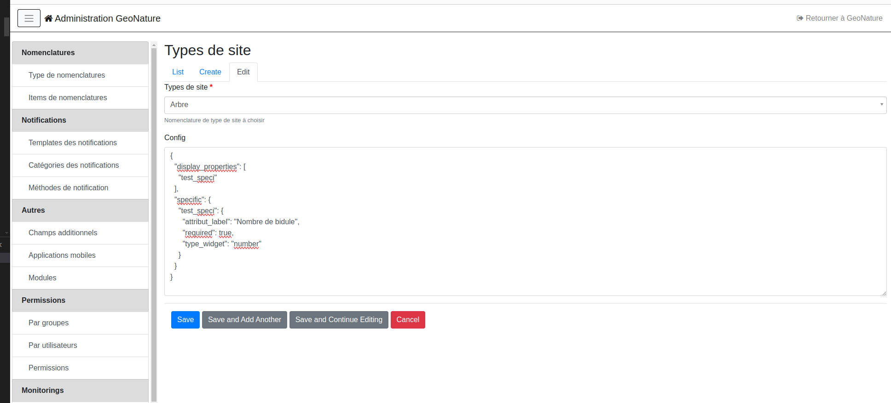
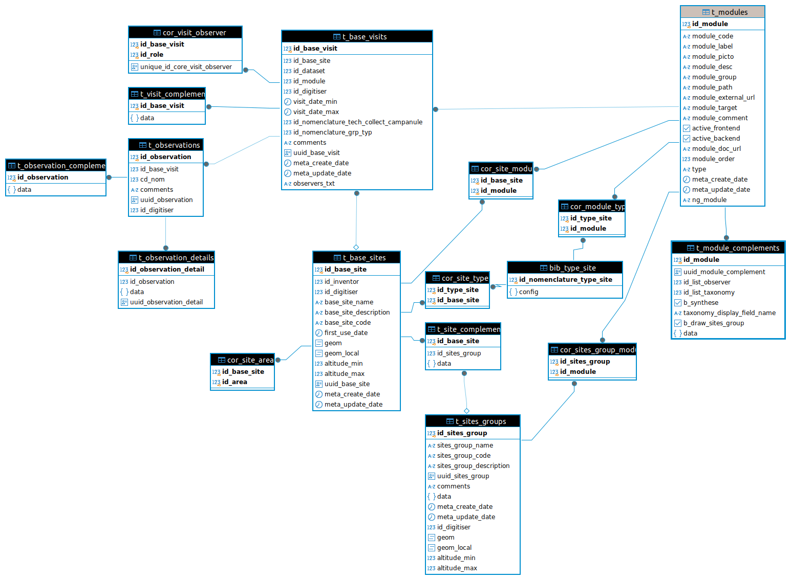

# Module Monitoring 

## Sommaire

* [Présentation du module](#présentation)
* [Installation du module](#installation-du-module)
* [Installation d'un sous-module](#installation-dun-sous-module)
* [Champs spécifiques d'un sous-module](#configuration-des-champs-sp%C3%A9cifiques-dun-sous-module)
* [Gestion des sites et groupes de site](#gestion-des-sites)
* [Permissions](#permissions)
* [Base de données](#base-de-données)
* [Suivi d'individus (CMR)](docs/individuals.md)
* [Gestion de la synthèse](docs/synthese.md)
* [Documentation technique](docs/documentation_technique.md)
* [Liste des commandes](docs/commandes.md)

## Présentation

Ce module permet de générer de façon générique des interfaces de saisie correspondant à des protocoles de suivi.

Par "suivi", on entend un protocole dont le point d'entrée est un site géographique, sur lequel on va revenir régulièrement effectuer des visites. Il se distingue par sa structure du module "Occtax" dont l'objectif est de faire de la saisie de données opportunistes ou d'inventaire (sans revenir régulièrement sur le même site de suivi).

Le module est articulé autour de 3 concepts :

- les sites : l'objet géographique de suivi (qui peuvent être regroupés par groupes de sites)
- les visites : une visite est effectuée sur un site (date, observateurs)
- les observations : observations d'espèce faites durant la visite (qui peut être associé à un individu dans le cas des CMR)

Les 3 niveaux que sont les sites, les visites et les observations sont fournis avec un tronc commun (les champs génériques) qui peuvent être complétés par des champs spécifiques à chaque protocole. Ces champs spécifiques sont définis par des fichiers de configuration JSON.

Pour chaque sous-module, correspondant à un protocole spécifique de suivi, il est ainsi possible d'ajouter dynamiquement des champs de différents types (liste, nomenclature, booléen, date, radio, observateurs, texte, taxonomie...). Ceux-ci peuvent être obligatoires ou non, affichés ou non et avoir des valeurs par défaut (voir doc détaillée : [Création d'un sous-module](docs/sous_module.md)).


## Installation du module

- Téléchargez le module dans ``/home/<myuser>/``, en remplacant ``X.Y.Z`` par la version souhaitée

```bash
cd
wget https://github.com/PnX-SI/gn_module_monitoring/archive/X.Y.Z.zip
unzip X.Y.Z.zip
rm X.Y.Z.zip
```

- Renommez le répertoire du module

```bash
mv ~/gn_module_monitoring-X.Y.Z ~/gn_module_monitoring
```

- Lancez l'installation du module

```bash
source ~/geonature/backend/venv/bin/activate
geonature install-gn-module ~/gn_module_monitoring MONITORINGS
sudo systemctl restart geonature
deactivate
```

Il vous faut désormais attribuer des permissions aux groupes ou utilisateurs que vous souhaitez, pour qu'ils puissent accéder et utiliser le module (voir https://docs.geonature.fr/admin-manual.html#gestion-des-droits). Si besoin une commande permet d'attribuer automatiquement toutes les permissions dans tous les modules à un groupe ou utilisateur administrateur.

### Mise à jour du module

Pour mettre à jour le modue Monitoring, suivre la documentation de [mise à jour d'un module GeoNature](https://docs.geonature.fr/installation.html#mise-a-jour-du-module)

### Configuration générale du module

Le fichier de configuration `monitorings_config.toml.example` peut être modifié puis copié à la racine du dossier de config de GeoNature : `~/geonature/config`.

3 éléments sont paramétrables :

- `TITLE_MODULE` : Titre présent sur la page d'accueil du module Monitoring
- `DESCRIPTION_MODULE` : Description du module Monitoring également présent sur la page d'accueil
- `CODE_OBSERVERS_LIST` : Code de la liste d'observateurs qui est utilisée par défaut

## Installation d'un sous-module

### Récupérer le répertoire de configuration d'un sous-module de suivi

Par exemple le sous-module `test` présent dans le repertoire `contrib/test` du module Monitoring.

### Activer le venv de GeoNature

```sh
source ~/geonature/backend/venv/bin/activate
```

### Copie du dossier de configuration

Si il n'existe pas déjà, créer un dossier pour stocker les configurations des sous-modules dans GeoNature (`geonature/backend/media/monitorings`) :

```sh
mkdir geonature/backend/media/monitorings
```

Créer un lien symbolique vers le dossier du sous-module dans le dossier `media` de GeoNature :

```sh
ln -s <chemin absolu du dossier du sous-module> ~/geonature/backend/media/monitorings/<nom du dossier du sous-module>
```

Exemple pour le module "test" : 

```
ln -s ~/gn_module_monitoring/contrib/test ~/geonature/backend/media/monitorings/test
```

### Lancer la commande d'installation du sous-module

```sh
geonature monitorings install <module_code>
```

Si le code du sous-module n'est pas renseigné ou si le dossier du sous-module n'existe pas, la commande va afficher la liste des sous-modules installés et disponibles.

```sh
geonature monitorings install
```

La commande va fournir la sortie suivante :

```
Modules disponibles :

- module3: Module 3 (Troisième exemple de module)
- module4: Module 4 (...)
- module5: Module 5 (...)
- <module_code>: <module_label> (<module_desc>)

Modules installés :

- module1: Module 1 (Premier exemple de module)
- module2: Module 2 (Deuxième exemple de module)
```

Il vous faut désormais attribuer des permissions aux groupes ou utilisateurs que vous souhaitez, pour qu'ils puissent accéder et utiliser le sous-module (voir <https://docs.geonature.fr/admin-manual.html#gestion-des-droits>). Si besoin une commande permet d'attribuer automatiquement toutes les permissions dans tous les modules à un groupe ou utilisateur administrateur.

### Configurer un sous-module

#### Dans le menu de droite de GeoNature, cliquer sur le module "Monitorings"

Le sous-module installé précedemment doit s'afficher dans la liste des sous-modules.

#### Cliquez sur le sous-module

Vous êtes désormais sur la page du sous-module. Un message apparaît pour vous indiquer de configurer celui-ci.

#### Cliquez sur le bouton `Éditer`

Le formulaire d'édition du sous-module s'affiche et vous pouvez renseigner les variables suivantes :

* Jeux de données *(obligatoire)* :
    * Un sous-module peut concerner un ou plusieurs jeux de données, le choix sera ensuite proposé au niveau de chaque visite.
* Liste des observateurs *(obligatoire)* :
    * La liste d'observateurs définit l'ensemble des observateurs possibles pour le sous-module (et de descripteurs de site).
    * Cette liste peut être gérée dans l'application `UsersHub`.
* Liste des taxons *(obligatoire selon le module)* :
    * Cette liste définit l'ensemble des taxons concernés par ce sous-module. Elle est gérée dans l'application `TaxHub`.
* Activer la synchro synthèse *(non obligatoire, désactivée par défaut)* ?
    * Si on décide d'intégrer automatiquement les données du sous-module dans la synthèse de GeoNature.
* Affichage des taxons *(obligatoire)* ?
    * Définit comment sont affichés les taxons dans le module :
        * `lb_nom` : Nom latin,
        * `nom_vern,lb_nom` : Nom vernaculaire par defaut s'il existe, sinon nom latin.
* Afficher dans le menu latéral ? *(non obligatoire, non affiché par défaut)* :
    * On peut décider que le sous-module soit accessible directement depuis le menu latéral de GeoNature.
    * `active_frontend`
* Types de sites :
    * Permet d'associer des sites (créés dans le gestionnaire de sites) à un sous-module. Tous les sites dont le type est défini ici remonteront dans le module ([voir documentation sur le gestionnaire de sites (#gestionnaire-de-sites))
* Options spécifiques du sous-module :
    * Un sous-module peut présenter des options qui lui sont propres et définies dans les paramètres spécifiques du sous-module.

## Configuration des champs spécifiques d'un sous-module

Maintenant que le sous-module est installé, vous pouvez configurer ses champs spécifiques pour le faire correspondre à votre protocole de suivi.  
La documentation détaillée de la configuration des champs additionnels est ici :  [Configuration des champs d'un sous module](docs/sous_module.md)

Des exemples de sous-modules sont disponibles sur le dépôt <https://github.com/PnX-SI/protocoles_suivi/> :

* Protocole de suivi des oedicnèmes
* Protocole de suivi des mâles chanteurs de l'espèce chevêche
    d'Athena
* Protocole Suivi Temporel des Oiseaux de Montagne (STOM)
* Autres...

## Gestion des sites

Chaque sous-module permet de créer ses propres sites et groupes de sites. Cependant certains sites peuvent faire l'objet de plusieurs protocoles de suivi, c'est pouquoi le module Monitoring offre la possibilité de créer des sites et des groupes de sites globalement dans le **gestionnaire de site** et de les utiliser dans plusieurs sous-modules.


Dans le gestionnaire de sites, il est possible de créer, éditer, supprimer des sites et des groupes de sites de manière indépendante à la gestion de sous-modules. Il est également possible de saisir directement des visites et des observations en rattachant les visites au sous-module que l'on souhaite.

> [!IMPORTANT]
> **Associer un site à un sous-module**
>
> Plutôt que d'associer un à un les sites à des sous-modules, l'association entre un site et un sous-module se fait via la notion de **types de sites**. Une type de sites est un concept permettant de regrouper des sites qui font l'objet de plusieurs protocoles et qui partagent potentiellement une série de descripteurs communs. 
>
> Un "point d'écoute" qui va par exemple faire l'objet de plusieurs protocoles ornithologiques (STOC, oiseaux migrateurs etc...) peut être définit comme un type de sites.
>
> Lors de la configuration d'un sous-module (depuis l'interface), on doit l'associer à un ou des types de site. Tous les sites créés via le gestionnaire de sites dont le type correspond à celui défini au niveau du sous-module, remonteront dans la liste des sites du sous-module.
>
> **Associer un groupe de sites à un sous-module**
>
> L'association entre un groupe de sites et un sous-module se fait individuellement. Lorsque l'on crée un groupe de site dans le gestionnaire de sites, on l'associe directement à un ou plusieurs sous-modules.


**Définir des champs spécifique à un type de site**

Il est possible de définir des champs spécifiques communs à chaque type de sites.  
Contrairement aux configurations des sous-modules, celle-ci ne se fait pas dans un fichier JSON, mais dans le module Admin de GeoNature (rubrique Monitoring / Types de sites).



La syntaxe est la même que pour la création de champs d'un sous-module (voir [Création d'un sous-module](docs/sous_module.md)). La clé `specific` permettant de configurer les champs et la clé `display_properties` de définir les champs à afficher sur les fiches info des sites.

## Permissions

- Une permission définit si l'on peut accéder au module Monitoring (R sur Monitoring)
- Des permissions définissent si on peut accéder au gestionnaire de sites et y créer, modifier, supprimer des sites et groupes de sites
- Des permissions définissent si on peut gérer les types de sites dans le module Admin

Les permissions des sous-modules sont définies au niveau de chaque sous-module pour chaque type d'objet (sous-module, groupes de sites, sites, visites, observations) :

- `MONITORINGS_MODULES` - R : permet à l'utilisateur d'accéder au sous-module, de le voir dans la liste des sous-modules
- `MONITORINGS_MODULES` - U : action administrateur qui permet de configurer le sous-module et de synchroniser la synthèse
- `MONITORINGS_MODULES` - E : action qui permet aux utilisateurs d'exporter les données (si configuré au niveau du sous-module)
- `MONITORINGS_GRP_SITES` - CRUD : action de lire, créer, modifier, supprimer un groupe de sites
- `MONITORINGS_SITES` - CRUD : action de lire, créer, modifier, supprimer un site
- `MONITORINGS_VISITES` - CRUD : action de lire, créer, modifier, supprimer les visites, observations, observations détails

Les permissions des sous-modules peuvent être limitées avec une notion de portée : 'Mes données' ou 'Les données de mon organisme' : 

- Groupes de sites : la portée s'appuie sur son id_digitizer (et son organisme si la portée est de niveau 2)
- Site : id_digitizer ou id_inventor du site
- Visite : id_digitizer ou observers de la visite
- Observation : id_digitizer de l'observation ou permission de la visite
- Observation détail : héritée de permission de l'observation

Si vous modifiez la configuration d'un sous-module en y ajoutant des objets (ajout du niveau groupe de sites par exemple), il est possible de mettre à jour les permissions disponibles pour ce sous-module en utilisant la commande `update_module_available_permissions`.

## Base de données

Le module permet de générer des sous-modules (stockés dans la table `gn_commons.t_modules`) pour chaque protocole de suivi. Ils s'appuient sur les champs fixes des 3 tables `gn_monitoring.t_base_sites`, `gn_monitoring.t_base_visits` et `gn_monitoring.t_observations` qui peuvent chacunes être étendues avec des champs spécifiques et dynamiques stockés dans des champs de type `JSONB`.

Des fonctions SQL ainsi qu'une vue définie pour chaque protocole permettent d'alimenter automatiquement la synthèse de GeoNature à partir des données saisies dans chaque sous-module.

Les sites et groupes de sites peuvent être associés à plusieurs protocoles (sous-modules).



## Autres

* [Suivi d'individus (CMR)](docs/individuals.md)
* [Gestion de la synthèse](docs/synthese.md)
* [Documentation technique](docs/documentation_technique.md)
* [Liste des commandes](docs/commandes.md)
