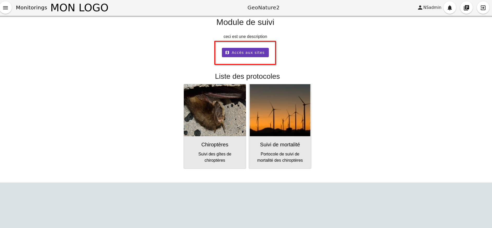
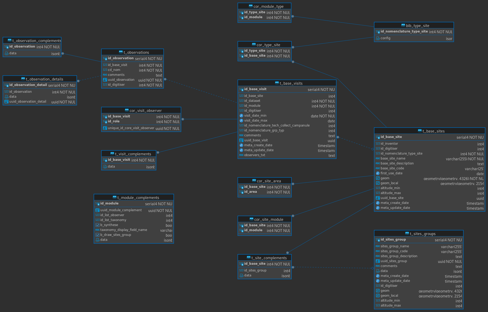

# Module GeoNature générique de suivis

## Module générique de gestion des données de protocoles de type suivis

Ce module permet de gérer de façon générique des données de protocoles "simples" articulés jusqu'à 4 niveaux : des groupes de site, puis des sites associés à ces groupes de site (nom, type, localisation) dans lesquels on fait des visites (dates, observateurs) dans lesquelles on peut faire des observations (espèces).

Les 3 niveaux que sont le sites, visites et observations peuvent être complétés des données spécifiques à chaque protocole, qui sont stockées dynamiquement dans la base de données sous forme de jsonb.


Le module permet de générer des sous-modules (stockés dans la table `gn_commons.t_modules`) pour chaque protocole de suivi. Ils s'appuient sur les champs fixes des 3 tables `gn_monitoring.t_base_sites`, `gn_monitoring.t_base_visits` et `gn_monitoring.t_observations` qui peuvent chacunes être étendues avec des champs spécifiques et dynamiques stockés dans des champs de type `JSONB`.

Les champs spécifiques de chaque sous-module sont définis dans des fichiers de configuration au format json.

Pour chaque sous-module, correspondant à un protocole spécifique de suivi, il est ainsi possible d'ajouter dynamiquement des champs de différent type (liste, nomenclature, booléen, date, radio, observateurs, texte, taxonomie...). Ceux-ci peuvent être obligatoires ou non, affichés ou non et avoir des valeurs par défaut. Les listes d'observateurs et d'espèces peuvent aussi être définies au niveau de chaque sous-module, en fonction du contexte du protocole de suivi.

Des fonctions SQL ainsi qu'une vue définie pour chaque protocole permettent d'alimenter automatiquement la synthèse de GeoNature à partir des données saisies dans chaque sous-module.

Via le module monitoring on peut également entrer directement via les sites et groupes de sites. Il est possible de crééer des groups de sites, des sites, associer des sites à des groupes de sites et ensuite pouvoir associer ces sites / groupes de site à différents sous modules.



Les sites et groupes de sites sont désormais multi protocoles.



## Sommaire

* [Installation](#installation)
* [Gestion de la synthèse](docs/synthese.md)
* [Documentation technique](docs/documentation_technique.md)
* [Création d'un sous-module](docs/sous_module.md)
* [Gestion des sites et groupes de site](docs/gestion_sites_groupes_de_site.md)
* [Mise à jour du module](docs/MAJ.md)
* [Liste des commandes](docs/commandes.md)
* [Permissions](#permissions)

## Installation

### Pré-requis

* Avoir GeoNature installé dans une version compatible avec celle de la version du module.

### Récupération du dépôt

Pour récupérer le code source du module, vous pouvez le télécharger ou le cloner.

#### Téléchargement

```sh
wget https://github.com/PnX-SI/gn_module_monitoring/archive/X.Y.Z.zip
unzip X.Y.Z.zip
rm X.Y.Z.zip
mv gn_module_monitoring-X.Y.Z gn_module_monitoring
```
Avec `X`, `Y`, `Z` correspondant à la version souhaitée.

#### Clonage du dépôt

```sh
git clone https://github.com/PnX-SI/gn_module_monitoring.git
```

### Installation du module

```sh
source ~/geonature/backend/venv/bin/activate
geonature install-gn-module ~/gn_module_monitoring MONITORINGS
sudo systemctl restart geonature
deactivate
```

Créer le dossier suivant dans le dossier `media` de GeoNature

```sh
mkdir ~/geonature/backend/media/monitorings
```

Il vous faut désormais attribuer des permissions aux groupes ou utilisateurs que vous souhaitez, pour qu'ils puissent accéder et utiliser le module (voir <https://docs.geonature.fr/admin-manual.html#gestion-des-droits>). Si besoin une commande permet d'attribuer automatiquement toutes les permissions dans tous les modules à un groupe ou utilisateur administrateur.

### Configuration générale du module monitoring

Un fichier de config `monitorings_config.toml.example` peut être modifié puis copié à la racine du dossier de config de GeoNature : `~/geonature/config`.

Trois champs sont paramétrable :

- `TITLE_MODULE` : Titre présent sur la page d'accueil du module monitoring
- `DESCRIPTION_MODULE` : Description du module monitoring également présente sur la page d'accueil
- `CODE_OBSERVERS_LIST` : Liste d'observateur qui est utilisé pour le fichier de config de `site.json` , qui permet d'avoir une liste d'observateur spécifique aux créateurs lorsqu'on entre directement par les sites/groupe de site . (Par défaut c'est la liste d'observateur occtax qui est utilisée)

<details open><summary> Exemple d'utilisation du paramètre `CODE_OBSERVERS_LIST`</summary>

```json
"id_inventor": {
      "type_widget": "observers",
      "attribut_label": "Observateur",
      "type_util": "user",
      "code_list":"CODE_OBSERVERS_LIST",
      "required": true,
      "multi_select": false
}
```

</details>

### Installation d'un sous-module

#### Récupérer le répertoire de configuration d'un sous-module de suivi

Par exemple le sous-module `test` présent dans le repertoire `contrib/test` du module de suivi.

#### Activer le venv de GeoNature

```sh
source ~/geonature/backend/venv/bin/activate
```

#### Copie du dossier de configuration

Créer un dossier pour référencer les configurations des sous-modules dans GeoNature (`geonature/backend/media/monitorings`) :

```sh
mkdir geonature/backend/media/monitorings
```

Créer un lien symbolique vers le dossier du sous-module dans le dossier `media` de GeoNature :

```sh
ln -s <chemin absolu du dossier du sous-module> ~/geonature/backend/media/monitorings/<nom du dossier du sous-module>
```

Exemple pour le module "test" : 

```
ln -s ~/gn_module_monitoring/contrib/test ~/geonature/backend/media/monitorings/test
```

#### Lancer la commande d'installation du sous-module

```sh
geonature monitorings install <module_code>
```

Si le code du sous-module n'est pas renseigné ou si le dossier du sous-module n'existe pas, la commande va afficher la liste des sous-modules installés et disponibles.

```sh
geonature monitorings install
```

La commande va fournir la sortie suivante :

```
Modules disponibles :

- module3: Module 3 (Troisième exemple de module)
- module4: Module 4 (...)
- module5: Module 5 (...)
- <module_code>: <module_label> (<module_desc>)

Modules installés :

- module1: Module 1 (Premier exemple de module)
- module2: Module 2 (Deuxième exemple de module)
```

Il vous faut désormais attribuer des permissions aux groupes ou utilisateurs que vous souhaitez, pour qu'ils puissent accéder et utiliser le sous-module (voir <https://docs.geonature.fr/admin-manual.html#gestion-des-droits>). Si besoin une commande permet d'attribuer automatiquement toutes les permissions dans tous les modules à un groupe ou utilisateur administrateur.

### Configurer le sous-module

#### Dans le menu de droite de GeoNature, cliquer sur le module "Monitorings"

Le sous-module installé précedemment doit s'afficher dans la liste des sous-modules.

#### Cliquez sur le sous-module

Vous êtes désormais sur la page du sous-module. Un message apparaît pour vous indiquer de configurer celui-ci.

#### Cliquez sur le bouton `Éditer`

Le formulaire d'édition du sous-module s'affiche et vous pouvez choisir les variables suivantes :

* Jeux de données *(obligatoire)* :
    * Un module peut concerner plusieurs jeux de données, le choix sera ensuite proposé au niveau de chaque visite.
* Liste des observateurs *(obligatoire)* :
    * La liste d'observateurs définit l'ensemble des observateurs possibles pour le module (et de descripteurs de site).
    * Cette liste peut être définie dans l'application `UsersHub`.
* Liste des taxons *(obligatoire selon le module)* :
    * Cette liste définit l'ensemble des taxons concernés par ce module. Elle est gérée dans l'application `TaxHub`.
* Activer la synthèse *(non obligatoire, désactivée par défaut)* ?
    * Si on décide d'intégrer les données du sous-module dans la synthèse de GeoNature.
* Affichage des taxons *(obligatoire)* ?
    * Définit comment sont affichés les taxons dans le module :
        * `lb_nom` : Nom latin,
        * `nom_vern,lb_nom` : Nom vernaculaire par defaut s'il existe, sinon nom latin.
* Afficher dans le menu ? *(non obligatoire, non affiché par défaut)* :
    * On peut décider que le sous-module soit accessible directement depuis le menu de gauche de GeoNature.
    * `active_frontend`
* Options spécifiques du sous-module :
    * Un sous-module peut présenter des options qui lui sont propres et définies dans les paramètres spécifiques du sous-module.

### Exemples de sous-modules

D'autres exemples de sous-modules sont disponibles sur le dépôt
<https://github.com/PnX-SI/protocoles_suivi/> :

* Protocole de suivi des oedicnèmes,
* Protocole de suivi des mâles chanteurs de l'espèce chevêche
    d'Athena;
* Protocole Suivi Temporel des Oiseaux de Montagne (STOM)
* Autres...

## Permissions

Les permissions peuvent désormais être définies avec une notion de portée ('mes données', 'les données de mon organisme', 'toutes les données' si on ne précise pas de portée mais qu'on accorde une permission). Ces permissions peuvent être définies sur chaque objet défini ci dessous.

La gestion des permissions pour les rôles (utilisateur ou groupe) se réalise au niveau de l'interface d'administration des permissions de GeoNature.

Les permissions sont définis pour chaque type d'objet (modules, groupes de sites, sites, visites, observations et types de site) :

- MONITORINGS_MODULES - R : permet a l'utilisateur d'accéder au module, de le voir dans la liste des modules
- MONITORINGS_MODULES - U : action administrateur qui permet de configurer le module et de synchroniser la synthèse
- MONITORINGS_MODULES - E : action qui permet aux utilisateurs d'exporter les données (si défini par le module)
- MONITORINGS_GRP_SITES - CRUD : action de lire, créer, modifier, supprimer un groupe de site
- MONITORINGS_SITES - CRUD : action de lire, créer, modifier, supprimer un site
- MONITORINGS_VISITES - CRUD : action de lire, créer, modifier, supprimer les visites, observations, observations détails
- TYPES_SITES- CRUD : action de lire, créer, modifier, supprimer les types de sites via l'interface administrateur

Par défaut, dès qu'un utilisateur a un droit supérieur à 0 pour une action (c-a-d aucune portée) il peut réaliser cette action.

Il est possible de mettre à jour les permissions disponibles pour un module en utilisant la commande `update_module_available_permissions`
