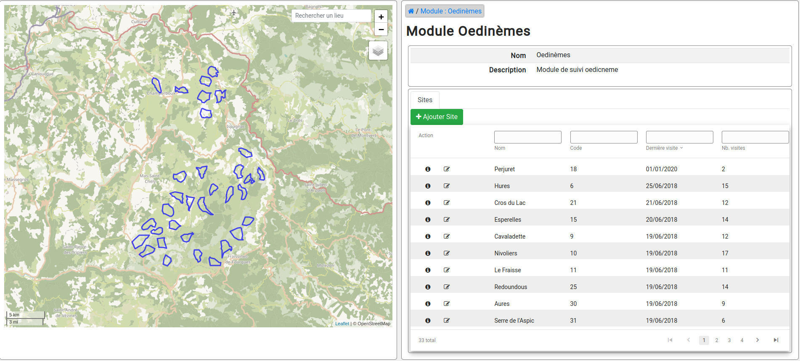
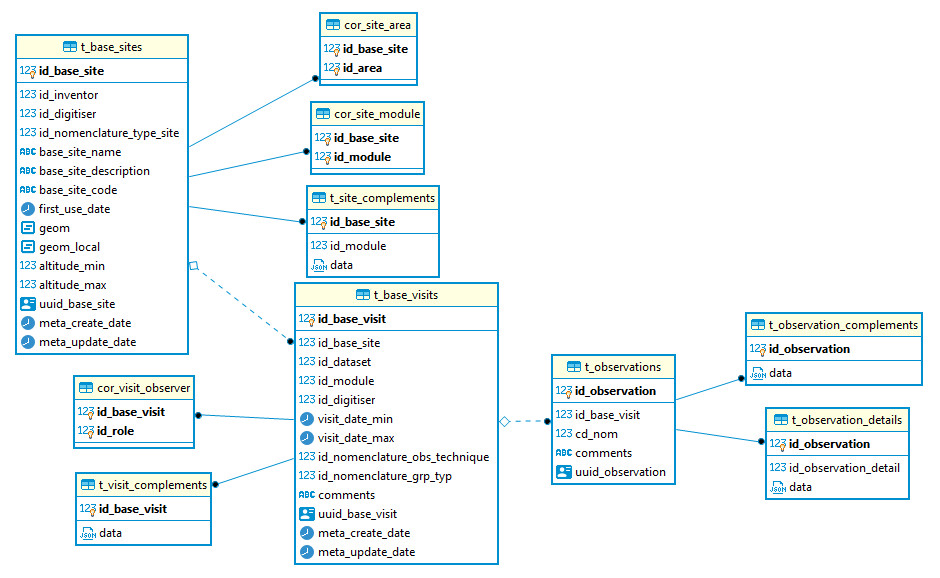

Module GeoNature de suivis génériques
#####################################

Module générique de gestion des données de protocoles de type suivis
********************************************************************

Ce module permet de gérer de façon générique des données de protocoles "simples" articulés en 3 niveaux :
des sites (nom, type, localisation) dans lesquels on fait des visites (dates, observateurs)
dans lesquelles on peut faire des observations (espèces).

Ces 3 niveaux peuvent être complétés des données spécifiques à chaque protocole, qui sont stockées dynamiquement dans la base de données sous forme de jsonb.

Le module permet de générer des sous-modules (stockés dans la table ``gn_commons.t_modules``) pour chaque protocole de suivi. Ils s'appuient sur les champs fixes des 3 tables ``gn_monitoring.t_base_sites``, ``gn_monitoring.t_base_visits`` et ``gn_monitoring.t_observations`` qui peuvent chacunes être étendues avec des champs spécifiques et dynamiques stockés dans des champs de type ``JSONB``.

Les champs spécifiques de chaque sous-module sont définis dans des fichiers de configuration au format json.

Pour chaque sous-module, correspondant à un protocole spécifique de suivi, il est ainsi possible d'ajouter dynamiquement des champs de différent type (liste, nomenclature, booléen, date, radio, observateurs, texte, taxonomie...). Ceux-ci peuvent être obligatoires ou non, affichés ou non et avoir des valeurs par défaut. Les listes d'observateurs et d'espèces peuvent aussi être définies au niveau de chaque sous-module, en fonction du contexte du protocole de suivi.

Des fonctions SQL ainsi qu'une vue définie pour chaque protocole permettent d'alimenter automatiquement la synthèse de GeoNature à partir des données saisies dans chaque sous-module.

Sommaire
********

* `Installation`_
* `Gestion de la synthèse <docs/synthese.rst>`_
* `Documentation technique <docs/documentation_technique.rst>`_
* `Création d'un sous-module <docs/sous_module.rst>`_
* `Mise à jour du module <docs/MAJ.rst>`_
* `Liste des commandes <docs/commandes.rst>`_
* `Permissions`_

Installation
************

Pré-requis
==========

- Avoir GeoNature installé dans une version compatible avec celle de la version du module.

Récupération du dépôt
=====================

Pour récupérer le code source du module, vous pouvez le télécharger ou le cloner.

Téléchargement
--------------

::

  wget https://github.com/PnX-SI/gn_module_monitoring/archive/X.Y.Z.zip
  unzip X.Y.Z.zip

Avec ``X``, ``Y``, ``Z`` correspondant à la version souhaitée.

Clonage du dépôt
----------------

::

    git clone https://github.com/PnX-SI/gn_module_monitoring.git

Installation du module
======================

::

  cd <path_to_geonature>
  source backend/venv/bin/activate
  geonature install-gn-module <path_to_module_monitoring> MONITORINGS
  sudo systemctl restart geonature

Créer le dossier suivant dans le dossier ``media`` de geonature

::

  mkdir <path_to_geonature>/backend/media/monitorings

Installation d'un sous-module
=============================

Récupérer le repertoire de configuration d'un sous-module de suivi
------------------------------------------------------------------

Par exemple le sous-module ``test`` présent dans le repertoire ``contrib/test`` du module de suivi.

Activer le venv de GeoNature
----------------------------

::

  cd <path_to_geonature>
  source backend/venv/bin/activate

Copie du dossier de configuration
---------------------------------

Copier le dossier du sous module dans le dossier ``media`` de geonature

::

  cp -R  <dossier du sous module> <path_to_geonature>/backend/media/monitorings/<module_code>

Si l'on souhaite développer un sous-module il peut parfois être plus pratique de faire un lien symbolique

::

  ln -s <dossier du sous module> <path_to_geonature>/backend/monitorings/<module_code>

Lancer la commande d'installation du sous-module
------------------------------------------------

::

  geonature monitorings install <module_code>

Configurer le sous-module
=========================

Dans le menu de droite de GeoNature, cliquer sur le module ``Monitoring``
-------------------------------------------------------------------------

Le sous-module installé précedemment doit s'afficher dans la liste des sous-modules.

Cliquez sur le sous-module
--------------------------

Vous êtes désormais sur la page du sous-module. Un message apparaît pour vous indiquer de configurer le module.

Cliquez sur le bouton ``Éditer``
--------------------------------

Le formulaire d'édition du module s'affiche et vous pouvez choisir les variable suivantes :

- Jeux de données *(obligatoire)* :

  - Un module peut concerner plusieurs jeux de données, le choix sera ensuite proposé au niveau de chaque visite.

- Liste des observateurs *(obligatoire)*:

  - La liste d'observateurs définit l'ensemble de observateurs possible pour le module (et de descripteurs de site).
  - Cette liste peut être définie dans l'application ``UsersHub``.

- Liste des taxons *(obligatoire selon le module)* :

  - Cette liste définit l'ensemble des taxons concernés par ce module. Elle est gérée dans l'application ``TaxHub``.

- Activer la synthèse *(non obligatoire, désactivée par défaut)* ?

  - Si on décide d'intégrer les données du sous-module dans la synthèse de GeoNature.

- Affichage des taxons *(obligatoire)* ?

  - Définit comment sont affichés les taxons dans le module :

    - ``lb_nom`` : Nom latin,
    - ``nom_vern,lb_nom`` : Nom vernaculaire par defaut s'il existe, sinon nom latin.

- Afficher dans le menu ? *(non obligatoire, non affiché par défaut)* :

  - On peut décider que le sous-module soit accessible directement depuis le menu de droite de GeoNature.
  - ``active_frontend``

- Options spécifiques du sous-module :

  - Un sous-module peut présenter des options qui lui sont propres et définies dans les paramètres spécifiques du sous-module.

Exemples de sous-modules
========================

D'autres exemples de sous-modules sont disponibles sur le dépôt https://github.com/PnX-SI/protocoles_suivi/ :

* Protocole de suivi des oedicnèmes,
* Protocole de suivi des mâles chanteurs de l'espèce chevêche d'Athena;
* Protocole Suivi Temporel des Oiseaux de Montagne (STOM)
* Autres...

Permissions
************

Les permissions ne sont implémentées que partiellement, la notion de portée (mes données, les données de mon organisme, toutes les données) n'est pas prise en compte. Si un utilisateur a le droit de réaliser une action sur un type d'objet, il peut le faire sur l'ensemble des données.

La gestion des permissions pour les rôles (utilisateur ou groupe) se réalise au niveau de l'interface d'administration des permissions de GeoNature.

Il est possible de spéficier les permissions pour chaque type d'objet (groupes de sites, sites, visites et observations). 

Si aucune permission n'est associé à l'objet, les permissions auront comme valeurs celles associées au sous-module qui lui-même hérite des permissions du module Monitoring qui lui-même hérite de GeoNature.

Par défaut, dès qu'un utilisateur a un droit supérieur à 0 pour une action (c-a-d aucune portée) il peut réaliser cette action. Il est possible de surcharger les paramètres au niveau des fichiers de configuration des objets du module. (cf configuration des sous-modules).
