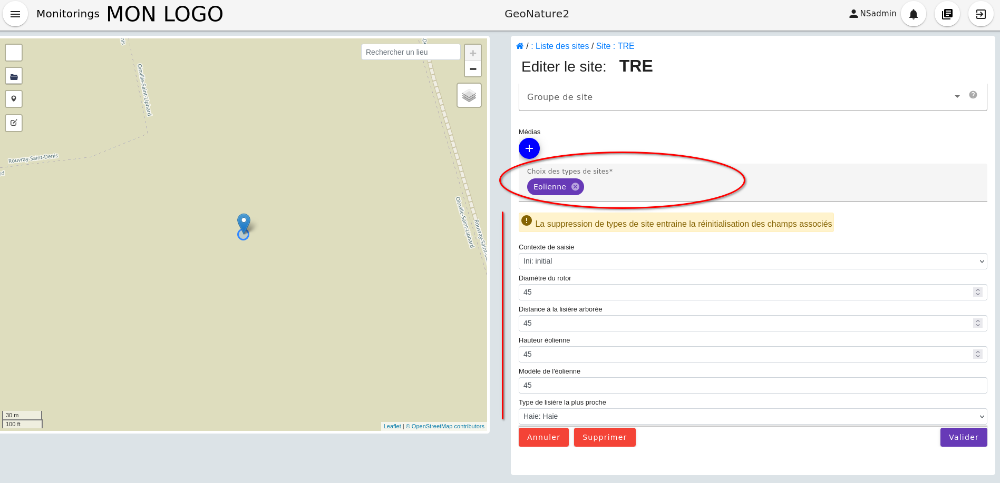

# Entrée par les sites et groupes de sites

Il est possible de créer, éditer, supprimer, modifier des sites et des groupes de site de manière indépendante à la gestion de sous modules.

Lorsqu'on entre par `Accès aux sites` depuis la page d'accueil (voir image ci dessous) on arrive sur deux onglets : `Groupe de sites` et `Sites`.

<details open><summary> Image représentant la page d'accueil avec l'accès aux sites</summary>


</details>

Via ces deux onglets on peut créer , éditer, supprimer des groupes de sites et des sites.
On peut ensuite directement via l'onglet "Sites" créer des visites en choisissant au préalable le protocole qui sera associé au site (voir exemple image ci dessous). La liste des protocoles sélectionnables dépend des types de site associés aux protocoles (comme expliqué [ici](./sous_module.md#structure-dun-module) )

<details open><summary> Image représentant l'ajout d'une visite en passant par l'ongle "Site"</summary>


</details>

Dans le formulaire d'édition et de création de site il y a un champ `Choix des types de sites` obligatoire et qui est lié au fichier de configuration créer dans l'interface administrateur dans le menu `TYPES DE SITES`.
La structure du fichier de configuration d'un type de site est basé sur le même modèle que ceux présentés [ici](./sous_module.md#définir-une-nouvelle-variable) dans la partie `Configuration sous module` .

<details open>
<summary>Exemple d'un fichier de configuration de type de site (ici pour l'Eolienne)</summary>

```json
{
  "display_list": ["modele_eolienne", "contexte_saisie"],
  "display_properties": [
    "type_lisiere",
    "diametre_rotor",
    "modele_eolienne",
    "contexte_saisie",
    "distance_lisiere",
    "hauteur_eolienne"
  ],
  "filters": {
    "inactif": false
  },
  "genre": "M",
  "geometry_type": "Point",
  "label": "Eolienne",
  "label_list": "Eoliennes",
  "sorts": [
    {
      "dir": "asc",
      "prop": "last_visit"
    }
  ],
  "specific": {
    "contexte_saisie": {
      "attribut_label": "Contexte de saisie",
      "required": true,
      "type_widget": "select",
      "values": ["Ini: initial", "Rep: repowering", "Ext: extension"]
    },
    "diametre_rotor": {
      "attribut_label": "Diamètre du rotor",
      "min": 0,
      "required": true,
      "type_widget": "number"
    },
    "distance_lisiere": {
      "attribut_label": "Distance à la lisière arborée",
      "min": 0,
      "required": true,
      "type_widget": "number"
    },
    "hauteur_eolienne": {
      "attribut_label": "Hauteur éolienne",
      "min": 0,
      "required": true,
      "type_widget": "number"
    },
    "modele_eolienne": {
      "attribut_label": "Modèle de l'éolienne",
      "required": true,
      "type_widget": "text"
    },
    "type_lisiere": {
      "attribut_label": "Type de lisière la plus proche",
      "required": true,
      "type_widget": "select",
      "values": ["Haie: Haie", "Foret: Forêt"]
    }
  }
}
```

<details open>
<summary>
Et ci dessous l'image représentant le formulaire d'édition d'un site au quel on ajoute un type de site Eolienne
</summary>



</details>

</details>
