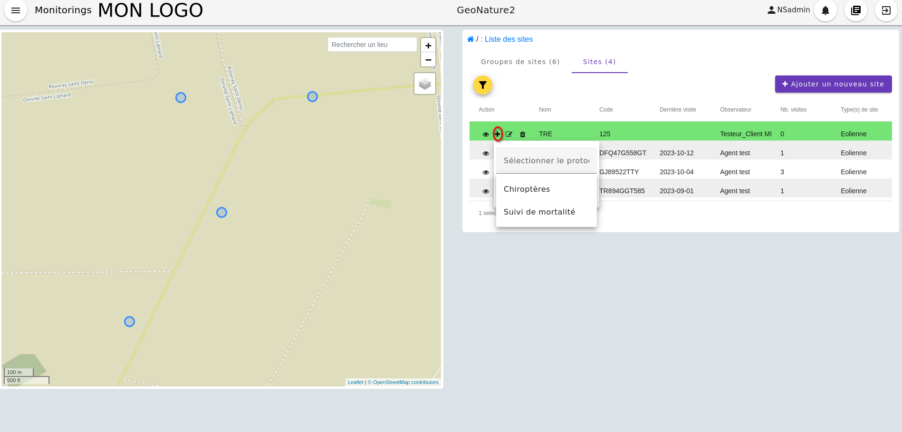

# Entrée par les sites et groupes de sites

Il est possible de créer, éditer, supprimer, modifier des sites et des groupes de site de manière indépendante à la gestion de sous modules.

Lorsqu'on entre par `Accès aux sites` depuis la page d'accueil (voir image ci dessous) on arrive sur deux onglets : `Groupe de sites` et `Sites`.

 Image représentant la page d'accueil avec l'accès aux sites

Via ces deux onglets on peut créer , éditer, supprimer des groupes de sites et des sites.
On peut ensuite directement via l'onglet "Sites" créer des visites en choisissant au préalable le protocole qui sera associé au site (voir exemple image ci dessous). La liste des protocoles sélectionnables dépend des types de site associés aux protocoles (comme expliqué [ici](./sous_module.md#structure-dun-module) )

 Image représentant l'ajout d'une visite en passant par l'ongle "Site"

<!-- TODO: Expliquer le lien avec types de site et site (champs de formulaires pareil que pour la config d'un autre objet sauf que l'on doit l'enregistrer dans l'interface admin comme expiqué en introduction de la doc) -->
