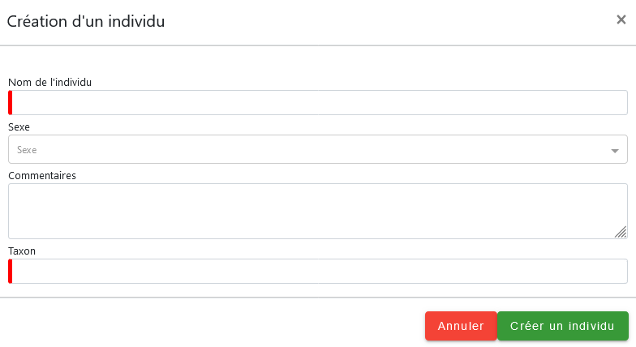

# Gestion des individus

## Introduction

Le suivi d'individus dans Monitoring permet de :

- Créer des individus
- Créer des marquages associés aux individus (un individu peut 
  avoir plusieurs marquages)
- Partager des individus entre les modules (pas encore possible ?)

## Base de données

Le schéma de base de données est le suivant :


> **_NOTE:_** Les tables en gris sont affichées à des fins de compréhension.

## Nomenclature

Le type de marquage est stocké dans une nomenclature dont le type 
est `TYP_MARQUAGE`. Ce type a été spécialement créé pour le marquage des
individus.

## Implémentation dans le module

### Objets à déclarer

Il y a donc 2 objets déclarés dans le module : 

- `individual`
- `marking`

L'objet `marking` doit être un enfant de l'objet `individual`. Dans 
le fichier `config.json` d'un sous-module, il suffit de déclarer
le `tree` comme suit :

```json
"tree": {
    "module": {
      "site": {
        "visit": {
          "observation": null
        }
      },
      "individual": {
        "marking": null
      }
    }
  }
```

L'objet `individual` peut être inséré comme tel pour créer un onglet
au même niveau que le site afin d'avoir la liste d'individus 
facilement accessible.

Des champs additionnels personnalisés peuvent être définis au niveau des marquages
des individus via la création d'un fichier `marking.json`. 
Il n'est pas possible d'ajouter de champs additionnels au niveau des individus eux-mêmes. 
Cette impossibilité émane du fait que le [widget individu](#le-widget-individu), 
créé côté GeoNature, propose un formulaire de création disposant de champs 
fixes qui ne doit donc pas différer du formulaire côté Monitoring.

### Le widget individu

Ce widget, disponible dans les composants de GeoNature, permet de :

- Sélectionner un individu déjà présent
- Créer un nouvel individu

Il se présente comme tel :


Et en cliquant sur le "+", un formulaire de création d'individu apparaîtra :



Il est paramétrable en json comme ceci : 

```json
"id_individual": {
    "type_widget": "individuals",
    "attribut_label": "Choix de l'individu",
    "id_module": "__MODULE.ID_MODULE",
    "id_list": "__MODULE.ID_LIST_TAXONOMY",
    "cd_nom": "__MODULE.CD_NOM"
}
```

Les attributs sont optionnels (si le contraire n'est pas spécifié) et sont les suivants :

- `id_module` (**obligatoire**) : permet de spécifier le sous-module auquel 
  doivent être rattachés les individus proposés dans le menu déroulant.
  Il est obligatoire pour assurer le calcul de permissions de 
  l'utilisateur en "Read" et en "Create".
- `id_list` : dans le formulaire de saisie, restreint la saisie d'espèces à
  une liste taxonomique
- `cd_nom` : fixe le champ Taxon au cd_nom donné et donc ne le fait pas
  apparaître dans le formulaire.

### Cas d'un protocole mono-spécifique

Il est possible de renseigner une seule espèce pour un protocole.
Comme spécifié dans la documentation du sous-module, une variable 
`__MODULE.CD_NOM` est disponible pour renseigner un même `cd_nom` 
pour chaque widget.

Dans le cas des individus, le fichier `config.json` doit 
paramétrer un champ `cd_nom` et masquer le champ `id_list_taxonomy` 
(qui devient inutile si une seule espèce est définie) :

```json
{
  "module_label": "Test",
  "module_desc": "Module de test individus",
  "specific": {
    "cd_nom": {
      "type_widget": "taxonomy",
      "attribut_label": "Espèce",
      "type_util": "taxonomy",
      "required": true
    },
    "id_list_taxonomy": {
      "hidden": true
    }
  }
}
```

Le fichier `observation.json` peut donc être écrit de cette manière : 

```json
{
  "specific": {
    "cd_nom": {
       "type_widget": "text",
       "required": false,
       "hidden": true
    },
    "id_individual": {
      "type_widget": "individuals",
      "attribut_label": "Choix de l'individu",
      "id_module": "__MODULE.ID_MODULE",
      "id_list": "__MODULE.ID_LIST_TAXONOMY",
      "cd_nom": "__MODULE.CD_NOM",
      "hidden": false
    }
  }
}
```

## Cas des observations

Pour que les individus soient implémentés dans le module, la contrainte 
`NOT NULL` sur la colonne `cd_nom` de `gn_monitoring.t_observations` a du 
être supprimée au profit d'une contrainte `NOT NULL` sur la colonne `cd_nom`
**OU** la nouvelle colonne `id_individual`.

Pour pouvoir donc saisir des individus au lieu d'espèces dans une observation,
la configuration minimale du fichier `observation.json` doit être la suivante :

```json
{
  "specific": {
    "cd_nom": {
       "type_widget": "text",
       "required": false,
       "hidden": true
    },
    "id_individual": {
      "type_widget": "individuals",
      "attribut_label": "Choix de l'individu",
      "id_module": "__MODULE.ID_MODULE",
      "id_list": "__MODULE.ID_LIST_TAXONOMY",
      "hidden": false
    }
  }
}
```

Elle permet de désactiver la saisie du `cd_nom` au profit de l'individu.

## Permissions

Comme tout objet Monitoring, des permissions seront ajoutées à l'installation 
pour CRUD sur les objets `MONITORINGS_INDIVIDUALS` et `MONITORINGS_MARKINGS`.
